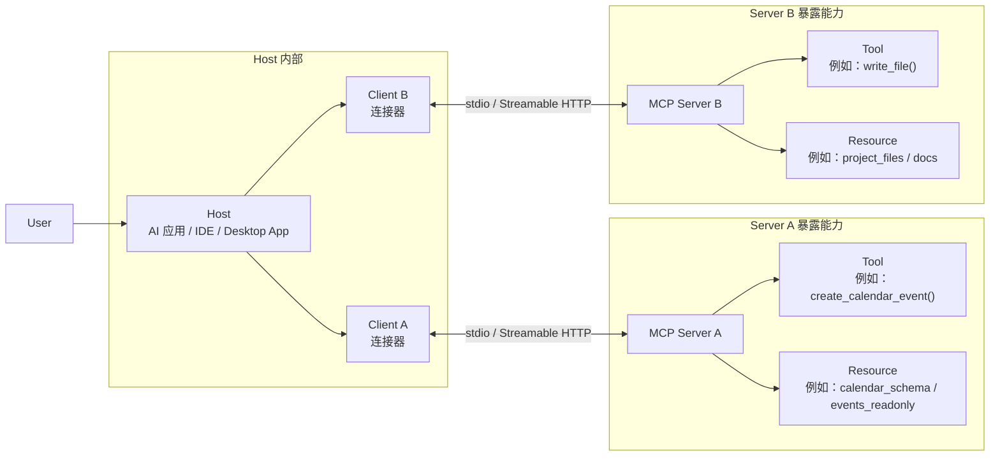

# MCP Day 1 架构图

## 最小 MCP 架构图

## 怎么读这张图

- `Host`
  - 是总控应用，负责和用户交互，也负责协调多个 MCP client
- `Client`
  - 是 Host 内部连接某个 server 的连接器
  - 一个 client 通常对应一条到某个 MCP server 的连接
- `Server`
  - 是能力提供者
  - 对外暴露 `tool`、`resource`，有些 server 还会暴露 `prompt`
- `Tool`
  - 用来做事，通常可能有副作用
- `Resource`
  - 提供只读上下文，给模型或用户查看

## 一句话总结

- Host 不直接“拥有所有能力”
- Host 通过多个 client 连接多个 server
- 每个 server 再把自己的 `tool` 和 `resource` 暴露出来给 Host 使用
